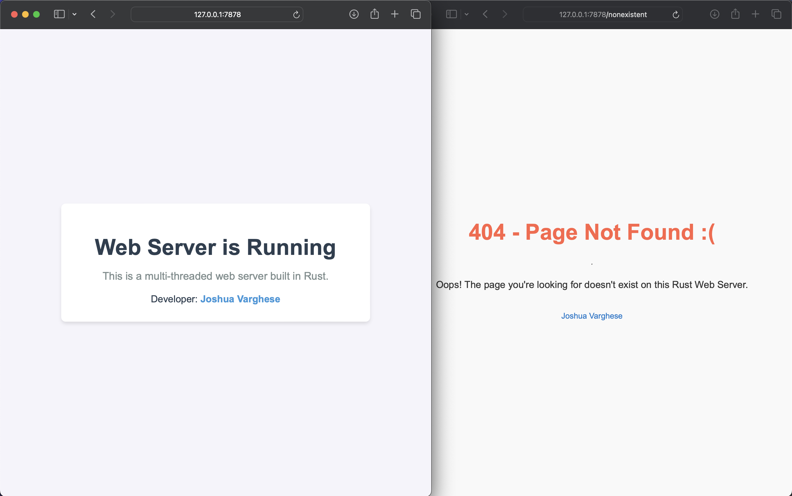
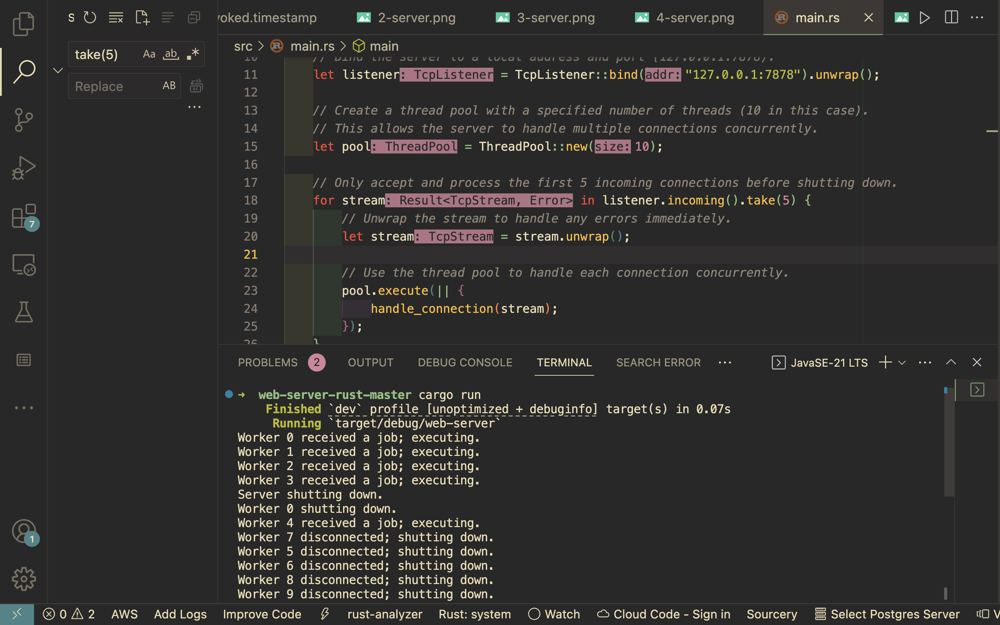

# Multi-Threaded Web Server in Rust

This project is a **multi-threaded web server** written in **Rust**. It demonstrates basic web server functionality with handling multiple client requests concurrently using threads.

## Features

- **Multi-threading**: The server is capable of handling multiple client requests simultaneously.
- **Static file serving**: It serves HTML pages (e.g., `index.html`, `404.html`).
- **Custom routes**: You can add custom paths to test the server.





## Prerequisites

- **Rust**: Make sure you have **Rust** installed. You can install it by following the instructions at [Rust installation guide](https://www.rust-lang.org/tools/install).

## Setup Instructions

### 1. Clone the Repository

Start by cloning this project to your local machine using Git:

```bash
git clone https://github.com/joshuabvarghese/web-server.git
cd web-server
